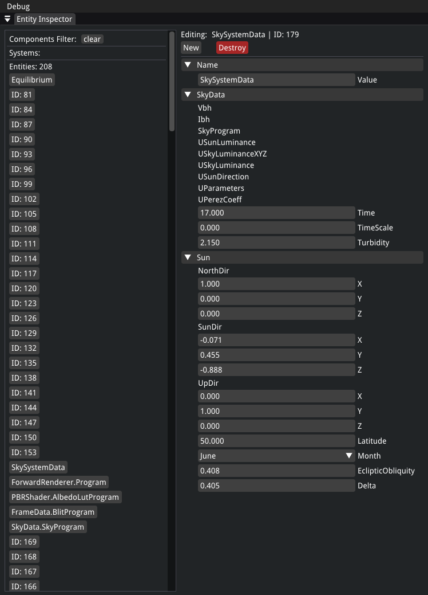

# EquilibriumEngine-CSharp

Equilibrium Engine is a data-oriented **C#** game engine that takes advantage of **ECS** pattern followed by **Hot-Reloading** of your libraries which allows you to quickly iterate on different aspects of your projects.

<p align="center">

</p>

## Features
#### clang is the primarily supported compiler

  * [Arch C# Entity Component System](https://github.com/genaray/Arch)
  * Forward Shading. [PBR & HDR Tonemapping](https://github.com/pezcode/Cluster)
  * [AssimpNet](https://bitbucket.org/Starnick/assimpnet/src/master/) model loading
  * **NET 7.0** API using **C++** libraries via PInvoke such as SDL, [BGFX](https://github.com/bkaradzic/bgfx) & [imgui](https://github.com/ocornut/imgui)

#### Hot-Reloading of scripts

https://user-images.githubusercontent.com/105135724/235316560-ea2e88df-0e1b-429f-97cb-9dbe3bc1102f.mp4

#### Entity inspector

<p align="center">

</p>

## Usage
#### To get started on Windows
* [Get VSCode](https://code.visualstudio.com/)
* [Install C# Extension](https://marketplace.visualstudio.com/items?itemName=ms-dotnettools.csharp)
* ```code .```
* Open command pallete ```Ctrl+Shift+P``` and select ```.NET Restore All Projects```
* ```Hit F5 to start debugging```

*You might need to install [NET 7.0 SDK](https://dotnet.microsoft.com/en-us/download/dotnet/7.0)*

## Screenshots

<p align="center">

</p>

<p align="center">

</p>

